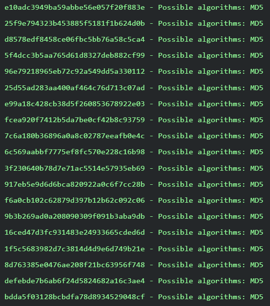
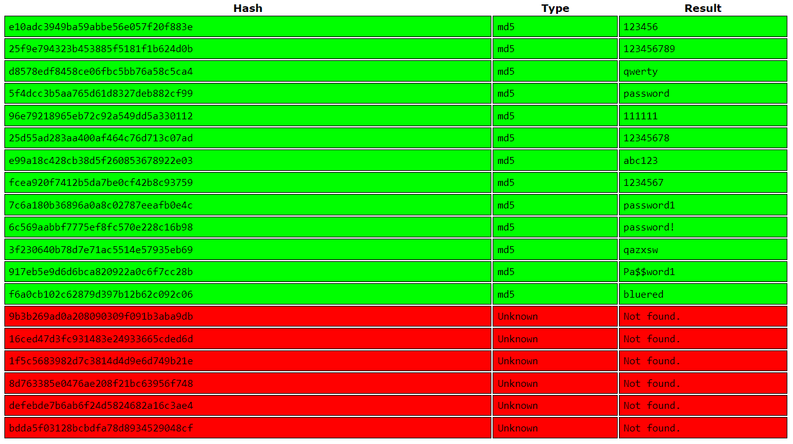

## Goldman Sachs - Crack leaked password database

In this Virtual Experience Program by Forage, we have to analyze results of a password database leak and propose uplifts to **password controls** and **security policies**

- ### Background information:

  As a governance analyst it is part of your duties to assess the level of protection offered by implemented controls and minimize the probability of a successful breach. To be successful at your job you often need to know the techniques used by hackers to circumvent implemented controls and propose uplifts to increase the overall level of security in an organization. Gaining valid credentials gives the attackers access to the organization’s IT system, thus circumventing most of perimeter controls in place.

- ### Task:
  Your job is to crack as many passwords as possible with available tools (e.g. use Hashcat). Here are your Task instructions:

1. Review the links provided in the additional resources below to gain a background understanding of password cracking
2. Try to crack the passwords provided in the `password_dump` file below using available tools
3. Assess the 5 questions in the task deliverables below in relation to the passwords provided `(type of hashing algorithm, level of protection, possible controls that could be implemented, password policy, changes in policy)`
4. Draft an email/memo briefly explaining your findings in relation to controls used by the organization and your proposed uplifts. We recommend spending about 1.5 hours on this task and keeping it at 1 page in length.
5. Your answer should be provided in the form of a `draft email/memo` explaining your findings and conclusions of controls currently used by an organization to prevent successful cracking of passwords and potential uplifts that you would propose to existing controls with justifications.

- ### Deliverables:

1. What type of hashing algorithm was used to protect passwords?
2. What level of protection does the mechanism offer for passwords?
3. What controls could be implemented to make cracking much harder for the hacker in the event of a password database leaking again?
4. What can you tell about the organization’s password policy (e.g. password length, key space, etc.)?
5. What would you change in the password policy to make breaking the passwords harder?

- ### Project Report and Observations
  Completing this task assigned by Goldman Sachs, MD5 and SHA were the two algorithms that I came across. Analysing the passwords and their respective security algorithms used, I narrowed down my observations into this report.
  The hashing algorithm used for each hash is given below:
  

The cracked versions of most hashed passwords are given below:


```
After the conducted analysis it was determined that organization uses an outdated password hashing algorithm (MD5) which offers very little protection in the event of a password database leaking. It was also determined that the current password policy is not aligned with industry best practices allowing users to have short passwords (6 characters) and reuse usernames as part of passwords.

As a result of the analysis the following uplifts are proposed to increase the overall level of password protection:
•	Use a dedicated password hashing algorithm bcrypt, scrypt or PBKDF2 as this will greatly increase the time needed to crack individual passwords,
•	Implement salting to prevent usage of rainbow tables to speed up cracking,
•	Increase the minimum password length requirement to 10 characters – this will increase the computational effort required to crack password and will give additional time to change all passwords in the event of the password database being leaked,
•	Prevent passwords to be the same as usernames or reused as part of the password – such password combination is easy to check without gaining access to the password database itself.
•	It is advised to educate users on creating safe and easy to remember passwords. Having a password policy requiring long passwords with a number of special characters results in user writing passwords down or constantly resetting them. The best way to create a strong and user-friendly password is using passphrases (e.g.  mygrannyschairhadstaples). The best way to create such passwords is to combine a couple of completely random word. It’s also advised to use some special characters and numbers as easy to remember substitutions to expand the key space (e.g. mYgranny$cha1rhadstaples)
•	Educate users on the benefits of passwords managers. Having a password manager allows having very long and completely random passwords (e.g. M>?{tk6Cfep6BrZ4J)KZWQ8j) without the need to remember/write down. A strong passphrase is still required as a master key for to access the password manager.
```

- ### References & Resources:

1. [Password Dump File](https://cdn.theforage.com/vinternships/companyassets/MBA4MnZTNFEoJZGnk/passwd_dump.txt) - Data file containing hashes dumped together
2. [Password Cracking Explained (2013)](https://arstechnica.com/information-technology/2013/05/how-crackers-make-minced-meat-out-of-your-passwords/)
3. [Password Salting](<https://en.wikipedia.org/wiki/Salt_(cryptography)>)
4. [Cryptographic Hash Functions](https://en.wikipedia.org/wiki/Cryptographic_hash_function)
5. [Password Cracking Tools](https://en.wikipedia.org/wiki/Password_cracking#Software)
6. [Password Strength Checker](https://howsecureismypassword.net/)

- ### Tools used:
  1. [Hash Type Identifier](https://hashes.com/en/tools/hash_identifier)
     Format: `'hash[:salt]'`
  1. CrackStation for decrypting hashed strings using their lookup database table.
